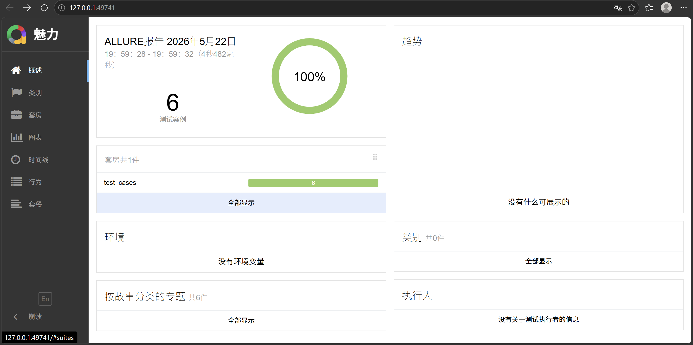

# 接口自动化测试框架 (API Test Framework)

基于 **Python + Requests + Pytest** 的轻量级接口自动化测试项目，以 [JSONPlaceholder](https://jsonplaceholder.typicode.com) 作为被测服务，实现对文章资源的 **增删改查（CRUD）** 自动化回归测试。

## 🛠 技术栈

| 技术 | 说明 |
|------|------|
| Python 3.8+ | 开发语言 |
| Requests | HTTP 请求库，封装 Session 管理 |
| Pytest | 测试框架，fixture + parametrize |
| JSONPlaceholder | 被测 RESTful API（稳定、免费、无需鉴权） |
| Postman | 手工接口调试，导出集合文件 |
| GitHub Actions | 持续集成，自动运行测试 |

## 📂 项目结构
## 🚀 快速开始
1. **克隆项目**：`git clone <你的仓库地址>`
2. **安装依赖**：`pip install -r requirements.txt`
3. **运行测试**：`pytest -v`

## 📝 测试覆盖
- ✅ 获取单篇文章（存在 / 不存在返回 404）
- ✅ 创建文章（期望状态码 201）
- ✅ 全量更新文章（PUT 方法）
- ✅ 局部更新文章（PATCH 方法）
- ✅ 删除文章

## 💡 设计亮点
- **分层架构**：配置、工具、用例三层分离，职责清晰
- **会话复用**：通过 `APIClient` 封装 `requests.Session`，避免重复连接开销
- **参数化测试**：使用 `pytest.mark.parametrize` 覆盖正常与异常场景（200 vs 404）
- **易于扩展**：框架预留鉴权注入点，可快速迁移到带 Token 的真实业务接口

## ⚙️ 持续集成
项目配置了 GitHub Actions，每次 Push 自动运行测试，保证代码质量。
## 📊 测试报告
项目集成 Allure 报告，运行 `pytest --alluredir=allure-results` 后可生成以下可视化报告：

---

## 📬 作者
周子旋 - 测试开发实习项目